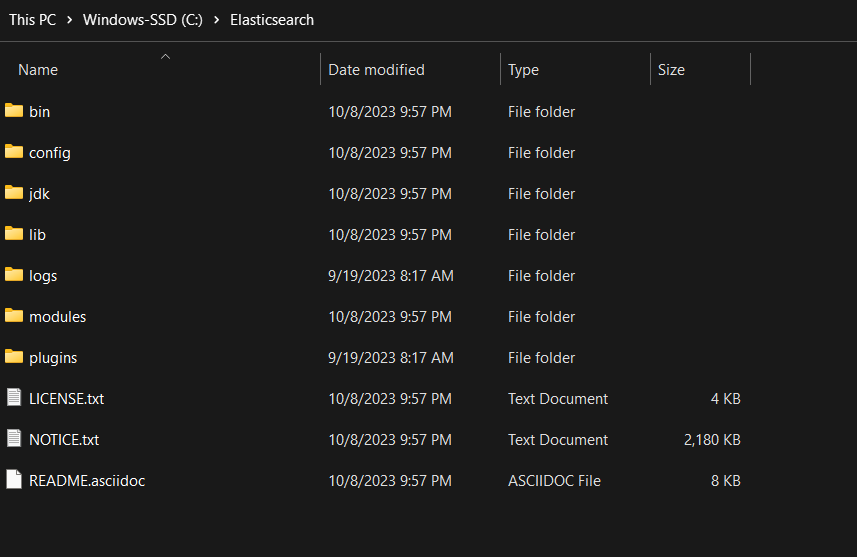

# Setting Up Elastic Search (Windows)

## Installation

### Pre-requisites

- Java Development Kit (JDK) , make sure the java version is at least Java 8.
    - You can check if JDK is installed by running the following command in the **command prompt**
        `java -version`
        ```
        java version "17.0.7" 2023-04-18 LTS
        Java(TM) SE Runtime Environment (build 17.0.7+8-LTS-224)
        Java HotSpot(TM) 64-Bit Server VM (build 17.0.7+8-LTS-224, mixed mode, sharing)
        ```
    
        java version "x.#.#" denotes we have Java x installed (x >= 8)
    - If any error occurs , you need to install java from the official oracle website : [https://www.oracle.com/in/java/technologies/downloads/#jdk21-windows](https://www.oracle.com/in/java/technologies/downloads/#jdk21-windows)


### Downloading

- Go the the [Elastic Search Website](https://www.elastic.co/)
- Click on **Resources** in the header and then Under **Developers** , Click on **Downloads**.
- Scroll Down untill **The free and open Elastic (ELK) Stack** and Download Elasticsearch. ( around 390 MB )

### InstalLing and Set-Up

-- unzip the zip file to your preffered location ( e.g. C:\Elasticsearch ) ,

It should look like this :


-- Navigate to the config folder ( C:\Elasticsearch\config ) , and open the `elasticsearch.yml` in a text editor.

-- Add the following lines of code to the file and **save** the file:

```yml{numberLines}

# ---------------------------------- Cluster -----------------------------------
#
# Use a descriptive name for your cluster:

cluster.name: test-cluster
# ------------------------------------ Node ------------------------------------
#
# Use a descriptive name for the node:

node.name: node-1

# ---------------------------------- Network -----------------------------------
#
# By default Elasticsearch is only accessible on localhost. Set a different
# address here to expose this node on the network:
#
network.host: 192.168.0.1
#
# By default Elasticsearch listens for HTTP traffic on the first free port it
# finds starting at 9200. Set a specific HTTP port here:
#
http.port: 9200

```

Ensure that your firewall or security group settings allow traffic on port 9200.

-- Open the command prompt and navigate to `bin` directory within Elasticsearch installation by running :

`cd [path-to-installation-directory(e.g. C:\Elasticsearch)]\bin`

-- To start the Elastisearch , run the command:

`elasticsearch.bat`


---------------------------------

error connecting to elasticsearch , socket hang up


